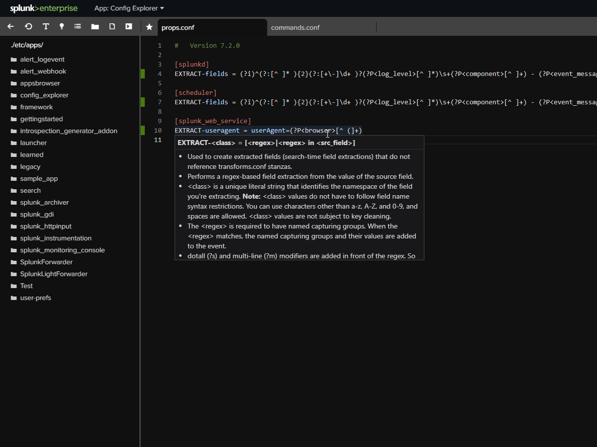

# Config Explorer



This app provides a modern editor interface for viewing and editing Splunk files. It has code completion and 
tooltip hinting for '.conf' files (by loading the Splunk '.spec' files). The code gutter highlights if the 
line can be found in the btool output or not.  By default, the app is not able to save files, but this can
be enabled from the "Settings" link. As this app essentially provides unrestricted access to the Splunk files, 
users must have "admin_all_objects" capability. The editor is Microsoft Monaco editor (Visual Studio Code).

This app can optionally version control all changes by committing them to a git repository before and after 
saving. To use this you need to have "git" installed (not provided by this app) and you need to setup a git 
repository using the instructions below.


## Important warnings:

* Don't use this app on Search Head clusters becuase it won't sync changes to cluster members. 
* As a matter of fact, because this app allows changing files just like you are on the filesystem, it should be 
used very carefully in any environment that you care about. 
* This app does not automatically update the Splunk running config (well except for search-time properties which
Splunk does regularly re-read).
* There are no built-in restrictions on viewing secrets files or passwords. Don't make this app available to 
users who should not see that sort of things.
* There are also no restrictions that prevent editing files in `default/` folders. You should follow normal Splunk 
best practices and only edit the `/local/*.conf` files or files in `default/` if you are the developer of that app.
* This app inherits the permissions of the user account that is running Splunk.
* By the way, all Splunk apps inherit the permissions of the Splunk user and can do things without your knowing. If 
you care about your Splunk instance, you should code review all apps before installing them.


There is some basic audit logging here: `index=_internal source="*config_explorer.log"`


Copyright (C) 2020 Chris Younger | [Source code](https://github.com/ChrisYounger/config_explorer) | [Feature requests and bugs](https://github.com/ChrisYounger/config_explorer/issues) | [Splunkbase](https://splunkbase.splunk.com/app/4353/)


  
## Using git auto-commit
Before enabling the git auto-complete feature you must first create a git repository somewhere. For example: 

```
$ cd /opt/splunk/etc
$ git init
```

You will probably also need to set a username and email address for config_explorer to use for commits:

```
git config user.name config_explorer
git config user.email config_explorer@splunk.acme.com
```

If you wish to use a non-standard git repository location, you can set these environment variables:

```
export GIT_DIR=/opt/splunk/.git/
export GIT_WORK_TREE=/opt/splunk/
```

You will need to consider your `.gitignore` file. If your directory already has `.gitignore` files in it, you 
may instead need to make a `.gitignore` file that ignores deeper nested `.gitignore` files.

Finally, if you want to push changes to an external repo, I would recommend you create a `script` input 
to do so, or alternatively, see my custom git app here: https://splunkbase.splunk.com/app/4182/


## Locking it down

In order to prevent file editing semi-permanantly, set `write_access = false`  and `hide_settings = true`.
This will prevent being able to change settings until someone changes files directly on the filesystem. 


## Third party software

The following third-party libraries are used by this app. Thank you!

* Monaco Editor - MIT - https://github.com/Microsoft/monaco-editor
* Sortable - MIT - https://github.com/rubaxa/Sortable.git
* OverlayScrollbars - MIT - https://github.com/KingSora/OverlayScrollbars
* Illustration by Ouch.pics - https://icons8.com
* Font Awesome - CC BY 4.0 License - https://fontawesome.com/
